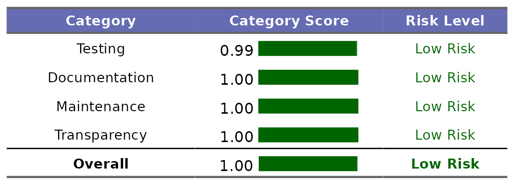
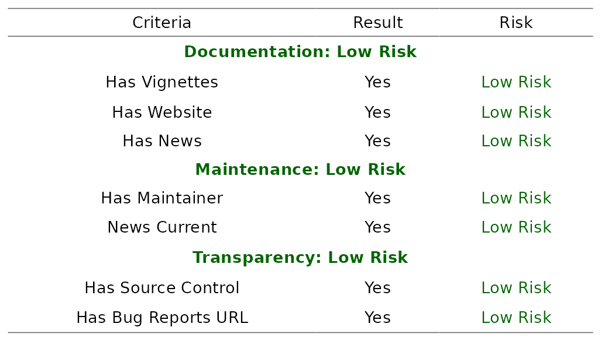
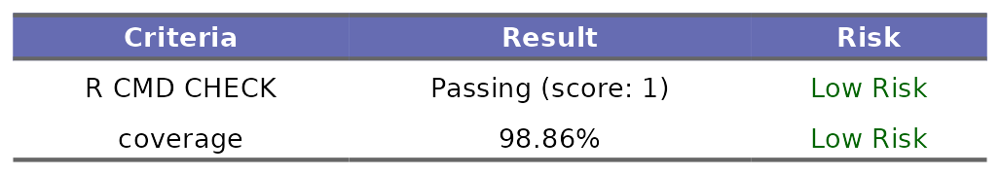
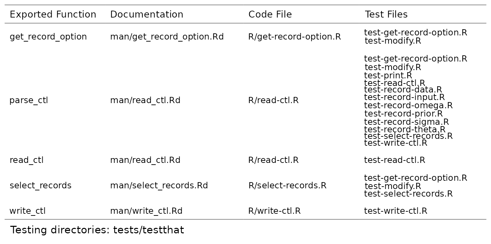

---
output:
  github_document:
    html_preview: false
always_allow_html: true
---


<!-- README.md is generated from README.Rmd. Please edit that file -->
<!-- To update the ReadMe PNGs, source `update-readme.R`, and run `update_readme()` -->

```{r, include = FALSE}
knitr::opts_chunk$set(
  comment = ".",
  echo = TRUE,
  eval = FALSE,
  message = FALSE,
  fig.align = "center"
)
```


# mpn.scorecard 

`mpn.scorecard` is an R package designed to score other R packages on key attributes that help evaluate the risk of adding them to [MPN](https://mpn.metworx.com/docs/). `mpn.scorecard` is essentially a wrapper of the [riskmetric](https://github.com/pharmaR/riskmetric) R package, with some additional features related to the scoring and outputs. Each package is first evaluated based on code documentation, maintenance and sustainability, and transparency. Code coverage and `R CMD Check` results are then tabulated and saved out to a specified location. These metrics are summarized in a scorecard report.

## Scoring a Package
You begin by scoring a package tarball, which will evaluate the aforementioned metrics, and save a `json` of the individual scores to `out_dir`. Code coverage and `R CMD Check` results are saved as `RDS` files to the same location. 

```{r}
results_dir <- score_pkg(
  pkg = "package_3.1.0.tar.gz",
  out_dir = file.path(tempdir(), "results")
)
```


## Rendering a Scorecard
You can then render a scorecard PDF with the desired risk breaks, which determine the cutoff points for "Low", "Medium", and "High" risk. The `R CMD Check` output and tabulated code coverage will appear in the appendix of the report.  
```{r}
pdf_path <- render_scorecard(
  results_dir = results_dir,
  risk_breaks = c(0.3, 0.7),
  add_traceability = TRUE
)

browseURL(pdf_path)
```


#### Overall Scores
Each of the evaluated metrics is summarized at the top of the report:


<center>
{width=600px}
</center>

<br>

#### Package Details
These metrics are further broken down in the next section, indicating specific risk assessments associated with the package:


<center>
{width=600px}
</center>

<br>


#### Testing Results
Here you can see a summary of the `R CMD Check` and testing coverage results. These are weighted higher than the other metrics and will have a greater impact on the overall score. You can see the full results in the appendix.


<center>
{width=600px}
</center>

<br>

#### Traceability Matrix (optional)
The optional argument, `add_traceability`, will append a table that links package exports to function documentation and test files:


<center>
{width=900px}
</center>


## Mitigation
Packages with low scores that fall short of initial expectations may include a mitigation text file. The presence of a mitigation section indicates that we are aware the score is low but are proceeding with adding the package to MPN. The rationale for doing so is included in the mitigation file itself. If a mitigation file matching the expected naming convention (`<package_tarball_name>.mitigation.txt` or `package_3.1.0.mitigation.txt` in the above example) is found in `results_dir`, this section will automatically be included.


## Summary Report
If multiple packages have been scored, you can summarize each of the packages in a summary report using `render_scorecard_summary`, providing an easy way of summarizing the overall risk associated with each package:

```{r}
result_dirs <- purrr::map_chr(pkg_tars, ~ score_pkg(.x, out_dir))

pdf_sum_path <- render_scorecard_summary(result_dirs, snapshot = as.character(Sys.Date()))

browseURL(pdf_sum_path)
```

