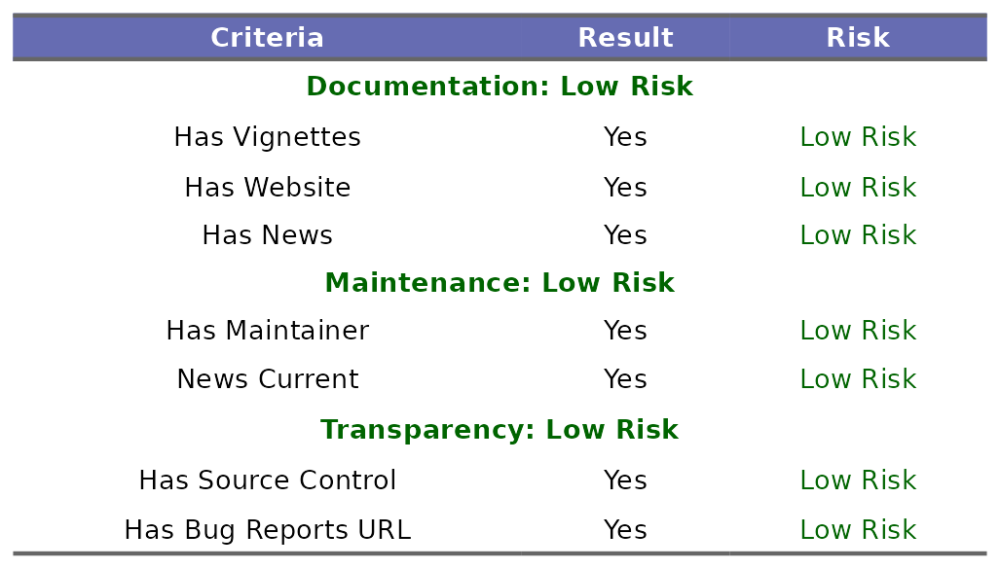

---
output:
  github_document:
    html_preview: false
always_allow_html: true
---


<!-- README.md is generated from README.Rmd. Please edit that file -->
<!-- To update the ReadMe PNGs, source `update-readme.R`, and run `update_readme()` -->

```{r, include = FALSE}
knitr::opts_chunk$set(
  comment = ".",
  echo = TRUE,
  eval = FALSE,
  message = FALSE,
  fig.align = "center"
)
```

<br>

# mpn.scorecard <a href='https://metrumresearchgroup.github.io/mpn.scorecard'></a>

<!-- badges: start -->

[](https://github-drone.metrumrg.com/metrumresearchgroup/mpn.scorecard)
<!-- badges: end -->

`mpn.scorecard` is an R package designed to score other R packages on key attributes that help evaluate the risk of adding them to [MPN](https://mpn.metworx.com/docs/). `mpn.scorecard` is essentially a wrapper of the [riskmetric](https://github.com/pharmaR/riskmetric) R package, with some additional features related to the scoring and outputs. Each package is first evaluated based on code documentation, maintenance and sustainability, and transparency. Code coverage and `R CMD Check` results are then tabulated and saved out to a specified location. These metrics are summarized in a scorecard report.

## Scoring a Package
You begin by scoring a package tarball, which will evaluate the aforementioned metrics, and save a `json` of the individual scores to `out_dir`. Code coverage and `R CMD Check` results are saved as `RDS` files to the same location. 

```{r}
results_dir <- score_pkg(
  pkg = "package_3.1.0.tar.gz",
  out_dir = file.path(tempdir(), "results")
)
```


## Rendering a Scorecard
You can then render a scorecard PDF with the desired risk breaks, which determine the cutoff points for "Low", "Medium", and "High" risk. The `R CMD Check` output and tabulated code coverage will appear in the appendix of the report.  
```{r}
pdf_path <- render_scorecard(
  results_dir = results_dir,
  risk_breaks = c(0.3, 0.7)
)

browseURL(pdf_path)
```


#### Overall Scores
Each of the evaluated metrics is summarized at the top of the report:


<br>

#### Package Details
These metrics are further broken down in the next section, indicating specific risk assessments associated with the package:



<br>

#### Testing Results
Here you can see a summary of the `R CMD Check` and testing coverage results. These are weighted higher than the other metrics and will have a greater impact on the overall score. You can see the full results in the appendix.


<br>

## Traceability Matrix (optional)
Our version of a traceability matrix maps R package exports to the following parameters:

 - R script the export is defined in
 - Any relevant documentation (`man/` files)
 - Test files that call the export
 
You can generate a traceability matrix as a standalone object by not passing a `results_dir`:
```{r}
trac_matrix <- make_traceability_matrix("package_3.1.0.tar.gz")
```

To add a traceability matrix to the **scorecard**, you must follow the steps below:

 - Score the package via `score_pkg`
 - Call `make_traceability_matrix` using the `results_dir` returned from `score_pkg`
 
If an `RDS` file matching the expected naming convention (`<package_tarball_name>.export_doc.rds` or `package_3.1.0.export_doc.rds` in the above example) is found in `results_dir`, the traceability matrix will be picked up and automatically included. Users can override this by setting `add_traceability` to `FALSE`.

```{r}
results_dir <- score_pkg(
  pkg = "package_3.1.0.tar.gz",
  out_dir = file.path(tempdir(), "results")
)

make_traceability_matrix("package_3.1.0.tar.gz", results_dir)

pdf_path <- render_scorecard(
  results_dir = results_dir,
  risk_breaks = c(0.3, 0.7),
  add_traceability = TRUE
)
```


## Comments (optional)

Packages may optionally include a "Comments" text file for additional explanatory notes. Inclusion of this section works the same as a traceability matrix. If a comment file matching the expected naming convention (`<package_tarball_name>.comments.txt` or `package_3.1.0.comments.txt` in the above example) is found in `results_dir`, the section will be automatically be included.


## Summary Report
If multiple packages have been scored, you can summarize each of the packages in a summary report using `render_scorecard_summary`, providing an easy way of summarizing the overall risk associated with each package:

```{r}
result_dirs <- purrr::map_chr(pkg_tars, ~ score_pkg(.x, out_dir))

pdf_sum_path <- render_scorecard_summary(result_dirs, snapshot = as.character(Sys.Date()))

browseURL(pdf_sum_path)
```
